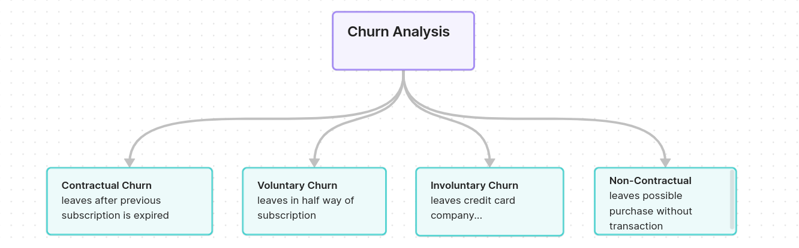

# Customer Churn Analysis

**Customer Churn**: Existing customer leaves our service/product. 
Customer churn analysis can be helpful for our company to retain those customers by understanding what is causing them to leave the service we are providing. There can be many reasons in general including: 
1. bad product/service
2. high pricing
3. better product available somewhere else
4. affordable product available somewhere else
5. Expectations mismatch
6. Missing feature functionality
7. and there can be many more reasons differentiating from industry to industry...

------

There are mainly four types of customer churn those are:
1. Contractual Churn: Customer stops using our service/product when his subscription in expire. 
2. Non-contractual Churn: Customer don't complete his payment and don't purchase our service/product. He changes his mind half way through. 
3. Volunteer Churn: Customer cancels his subscription in the middle of its use. 
4. Non-volunteer Churn: Customer discontinues with his existing credit card company hence we can not continue his subscription. 

-----